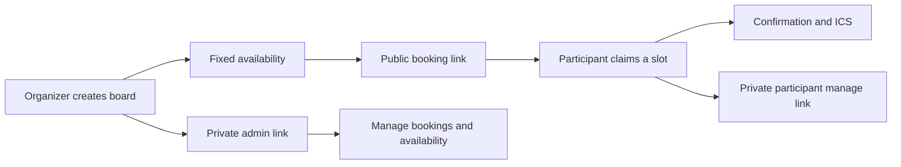

# mytimes

**A compact booking board for one-off interview rounds.**


mytimes turns a fixed set of interview times into one public booking link and
one private organizer link. Participants claim a slot without creating an
account or connecting a calendar; organizers get a focused workspace for
availability, bookings, recovery, exports and notifications.

> **Current status:** The codebase type-checks and builds successfully. The
> former production domain, `mytimes.co`, returned Railway's “Application not
> found” response when rechecked on 1 September 2026, so this README does not
> present the hosted service as available. `LAUNCH_STATUS.md` is a dated May
> 2026 deployment record rather than the current uptime source.

## Product in one minute

1. An organizer names an interview round and adds fixed time slots.
2. mytimes creates a public participant link and a private admin link.
3. A participant sees open times in their own timezone and claims one.
4. Both sides receive transactional email and calendar-ready details.
5. The participant can manage their booking through a private tokenized link.
6. The organizer can update availability, recover access, export bookings and
   review activity without exposing the admin capability publicly.



## Why it is deliberately narrow

mytimes is not general calendar software. It is designed for the short-lived
job of coordinating a batch of interviews:

- No participant account.
- No calendar OAuth.
- No recurring-rules engine.
- No multi-layer scheduling dashboard.
- One primary action per screen.

That constraint shaped both the information architecture and the technical
model. A board is a bounded object with explicit slots, capabilities and a
retention lifecycle—not a permanent calendar.

## Product and design decisions

- **Capability-based sharing.** Public, admin and participant-manage links carry
  different authority instead of relying on a single all-powerful URL.
- **Privacy by default.** Logs redact tokens, retention jobs scrub old personal
  data, and participants avoid account creation entirely.
- **Timezone clarity.** The booking surface translates slots without hiding the
  source timezone or date shifts.
- **Fast recovery.** Organizers can rotate compromised links and recover owned
  boards through verified account and email flows.
- **Idempotent writes.** Board creation and claims accept idempotency keys so a
  retry cannot silently duplicate a consequential action.
- **Progressive monetization.** Free limits, per-board unlocks and company
  entitlements are enforced in the API rather than only hidden in the UI.
- **Accessible interaction.** The design targets WCAG AA contrast, visible
  focus, keyboard navigation and reduced-motion preferences.

## Design system

The creative north star is **“the stamped interview packet”**: warm paper,
teal ink, compact controls and factual mono typography for times, dates, prices
and links. Real booking cards and day bands act as the product imagery instead
of generic SaaS illustration.

Design tokens are split into primitive and semantic layers, with focused style
modules for booking, creation, management, billing and account surfaces.

See [DESIGN.md](./DESIGN.md) for the complete visual language and component
rules.

## Architecture

```text
apps/slots/                 React booking and organizer interface
apps/slots-api/             TypeScript API, jobs and integrations
packages/slotboard-core/    Shared slots, tokens, ICS and calendar links
```

| Layer | Responsibilities |
|---|---|
| Web app | Create flow, public booking, admin desk, account, billing and recovery |
| API | Auth, boards, claims, rate limits, email, billing, exports and domains |
| Shared core | Slot rules, opaque-token helpers, ICS output and shared types |
| PostgreSQL | Boards, bookings, capabilities, accounts, entitlements and audit state |
| Jobs | Retention, archival, PII scrubbing and delivery processing |
| Integrations | Stripe, Resend/Postmark, Sentry, Railway and custom-domain DNS |

## Reliability and trust work

This prototype goes beyond the happy path:

- Request IDs and structured, token-redacted logs.
- Rate limiting and bounded database query timeouts.
- Signed Stripe and email-provider webhooks.
- Billing readiness checks that prevent checkout without fulfillment wiring.
- Backup and restore drills, not just backup creation.
- Retention jobs for archive, deletion, PII scrubbing and stale operational data.
- Tests for concurrent claims, privacy boundaries, auth recovery, billing
  entitlements, UI regressions and notification integrations.
- Readiness scripts for production email, billing, observability, retention and
  custom domains.

## Stack

- React, TypeScript and Vite with server-side prerendering
- Node.js TypeScript API
- PostgreSQL
- Better Auth for organizer accounts
- Tokenized public/admin/manage capabilities
- Stripe billing and customer portal
- Resend or Postmark transactional email
- Sentry-compatible frontend and API observability
- Docker and Railway deployment configuration

## Run locally

Install dependencies and start the included PostgreSQL service:

```bash
npm install
docker compose up -d postgres
docker compose exec -T postgres psql -U slotboard -d slotboard \
  < apps/slots-api/migrations/0001_slotboard.sql
```

Create a local `.env` from the placeholders in `.env.example`, then run the two
applications:

```bash
npm run dev:api
npm run dev:slots
```

- Frontend: `http://127.0.0.1:5174`
- API: `http://127.0.0.1:3014`

Never use production credentials in local development or commit secrets.

## Verification

Rechecked on 1 September 2026:

```bash
npm ci
npm run typecheck
npm run build
```

Both type-checking and the production frontend/API builds pass.

The repository also includes focused regression and readiness commands:

```bash
npm run test:api
npm run test:hardening
npm run test:billing
npm run test:auth-reset
npm run test:email
npm run test:booking-ui
npm run test:notification-integrations-ui
```

Database-backed and live-provider checks require the corresponding development
services and environment variables.

## Deeper documentation

- [Product definition](./PRODUCT.md)
- [Design system](./DESIGN.md)
- [Security model](./SECURITY.md)
- [Production runbook](./docs/production-runbook.md)
- [Dated launch record](./LAUNCH_STATUS.md)

## License

Portfolio source. No license is granted for reuse or redistribution.
